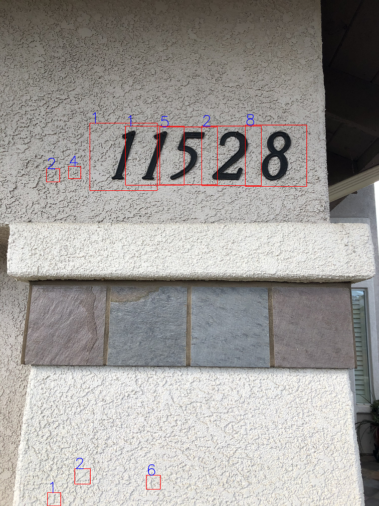

## Multi-digit House Number Detection Using Convolutional Neural Networks
### Author: John Hawkins


This repository contains code for performing object detection and classification on multi-digit house number images and video. The digit detection pipeline consists of a convolutional neural network (CNN) for classification and a maximally stable extremal regions algorithm (MSER) for digit region proposals to be fed through the classification network.

The convolutional neural network was trained using the Stanford Street View House Number (SVHN) image dataset for the digit 0-9 classes as well as the CIFAR-10 image dataset for training an 11th negative class (no digit). Data augmentation was performed on the SVHN image dataset to include digit orientation variation to train a more robust classification network. The SVHN image dataset already includes plentiful variation in color, font, noise and lighting.

The neural network used for classification is a custom CNN architecture consisting of 5 successive convolutional layers with each convolutional layer followed by a max-pooling layer. Each of the convolutional layers used the Re-Lu activation function in addition to “same” padding of the image border. In addition, batch normalization and dropout were added to each of these blocks. The last layer was a fully connected layer using the Re-Lu activation function before a soft-max output layer. This custom network was loosely modeled as a simplified version of the common network architecture called AlexNet. The Adam optimization algorithm was used to train the weights of the network. Adam can viewed as a combination of combination of stochastic gradient descent (SGD) with momentum and RMSProp. The network architecture, optimization algorithm and learning rate were chosen by trading bias and variance via training and validation set learning curves for each of the hyperparameters.

A naive approach for region proposal is to slide a fixed window over a Gaussian pyramid of downsampled images. A more efficient algorithm that can be used for digit region proposal is the maximally stable extremal regions (MSER) algorithm. The MSER algorithm finds blob regions of continuous pixel intensity within the image by sweeping an intensity threshold over the image and finding connected regions that become stable with respect to the threshold variation. A bounding box is then established about each of these regions, the region is extracted from the image, the region is resized and the region is passed through the CNN for classification. Scale invariance is inherent in the MSER algorithm because it can propose continuous regions of any size. The MSER algorithm can be multiple orders of magnitude faster than the sliding window and image pyramid approach because the number of regions has been reduced from (m-p)/s x (n-p)/s to some smaller set of proposed continuous blob regions, where m and n are the image dimensions, p is the sliding window dimension and s is the stride of the sliding window.

Finally, an algorithm called non-maximum suppression (NMS) is used to eliminate duplicate overlapping positive digit classifications. NMS uses a threshold on the intersection of union between all bounding boxes and when that threshold is breached only the bounding box with the highest classification confidence is kept.

State of the art end-to-end object detection architectures that prioritize speed like the RetinaNet network and YOLO network differ from the approach used here in that they use a "single-shot" detection approach that combines region proposal and classification into one neural network pass. Other state of the methods that prioritize accuracy over speed typically use a "two-shot" approach with one neural network for region proposals and another for classification.

### Prerequisites

In order to recreate the results of this project Python 3.6 must be installed along with the following packages:

```
tensorflow==2.1.0
scikit-learn==0.21.2
opencv-python==4.2.0.34
numpy==1.16.4
matplotlib==3.1.0
```

### Running The Code

Follow the steps below to train the classification network from scratch and save model weights:

```
1. Download SVHN Format 2 image dataset from http://ufldl.stanford.edu/housenumbers/
2. Download CIFAR-10 Matlab image dataset from https://www.cs.toronto.edu/~kriz/cifar.html
3. From terminal run "python train_network.py"
```

Follow the steps below to use pre-trained network weights to process new images:

```
1. Update "file_names" list in python script "process_image.py" to point to new images to process
2. From terminal run "python run.py"
```

Follow the steps below to use pre-trained network weights to process new video:

```
1. Update "video_file" in python script "process_video.py" to point to new video to process
2. From terminal run "python run_video.py"
```

### Sample Image Results

The following figures show the pipeline performance on a number of images that illustrate the pipeline is scale invariant, pose invariant, location invariant, lighting invariant, font invariant and noise invariant. The images also show some cases where the digit detector was fooled and returned false positives.



